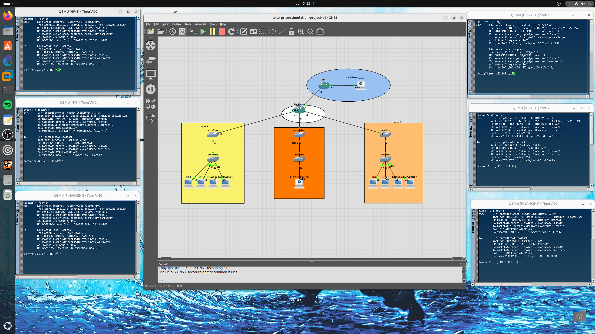
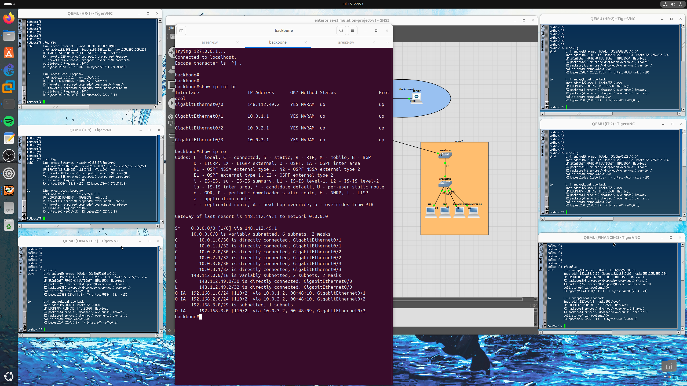
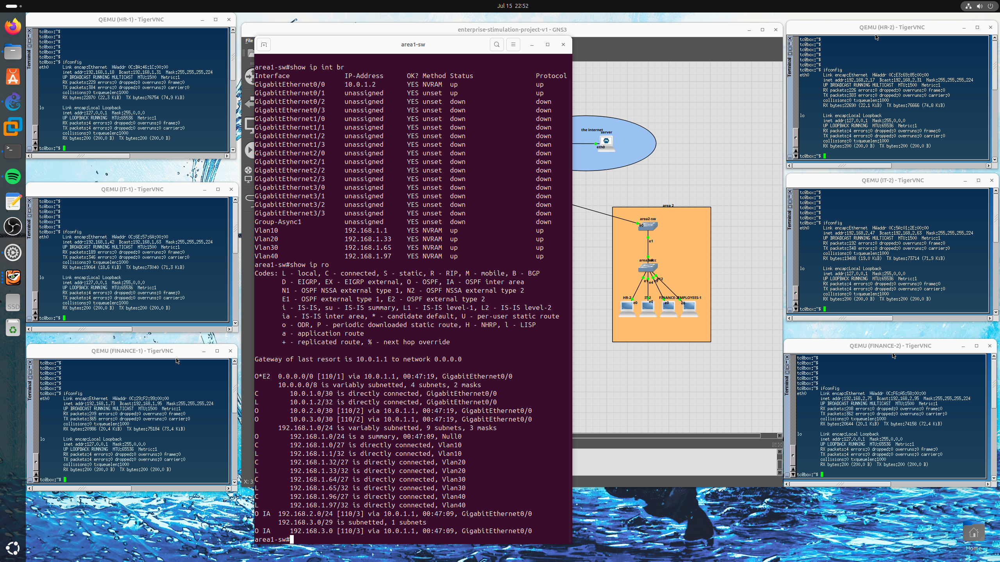
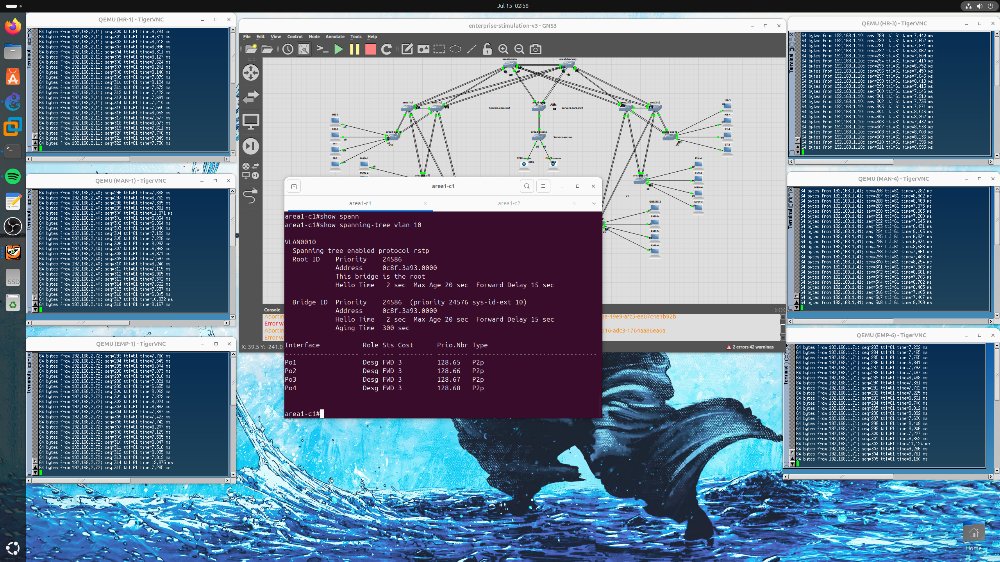
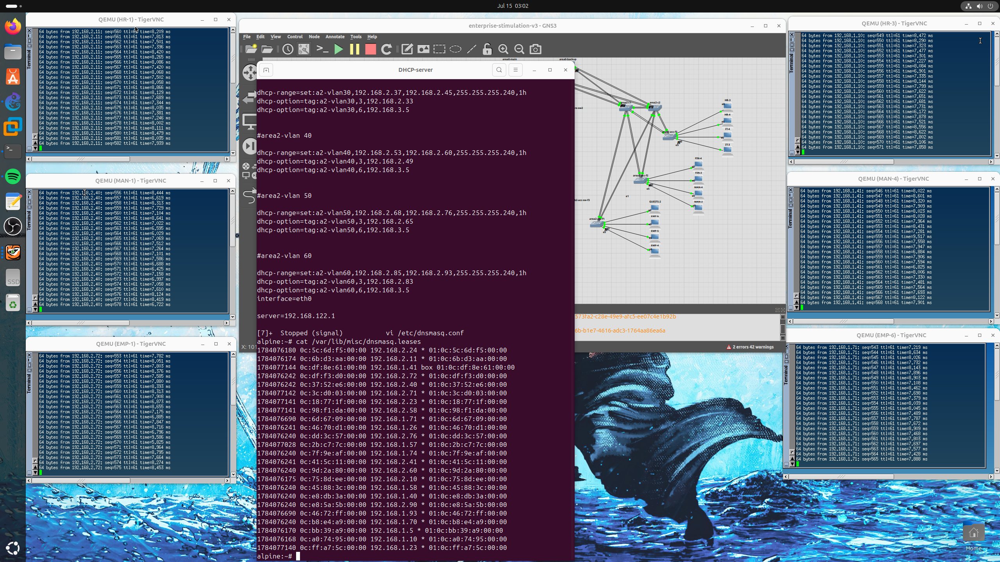
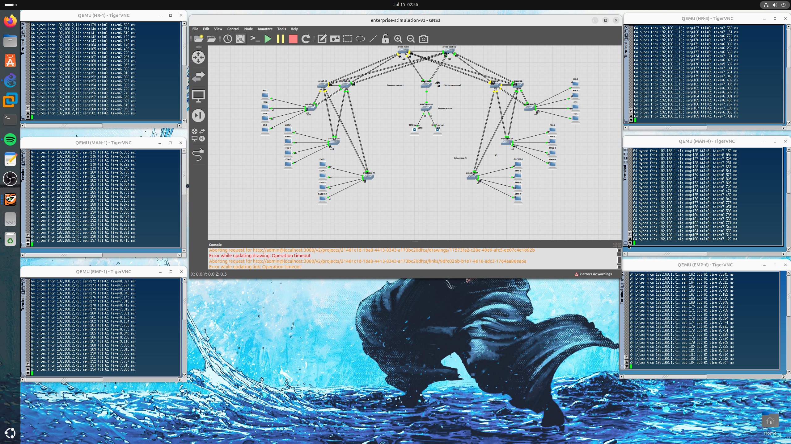
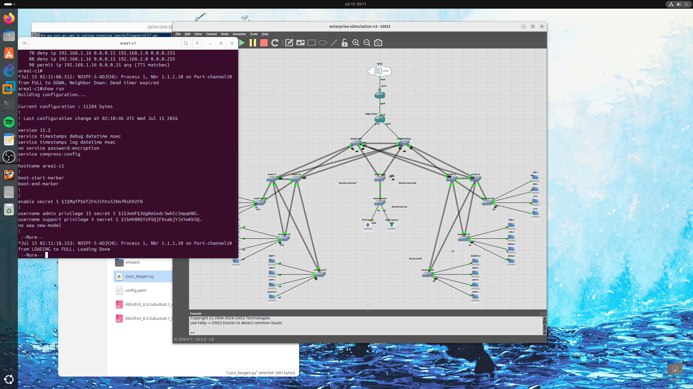
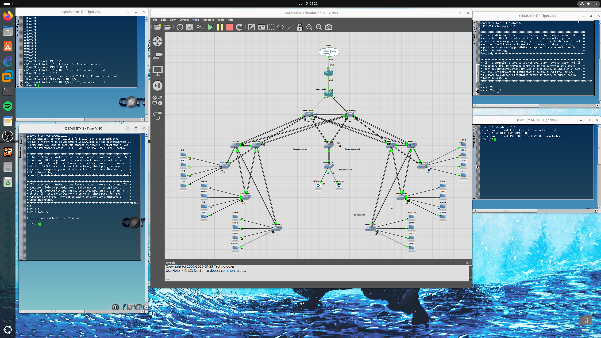
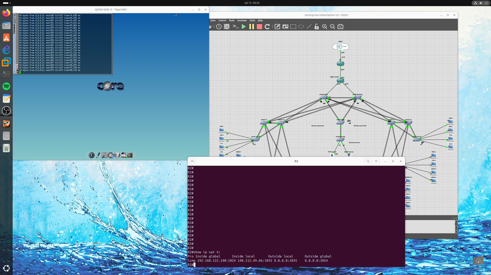

# 🏢 Enterprise Network Architecture & Security Simulation

## 📜 Project Overview
A comprehensive, multi-layered enterprise network simulation designed and built using **GNS3** and **Cisco IOSv**. This repository documents the step-by-step evolution of a corporate network from foundational connectivity (v1) to a highly available, fully redundant architecture (v2), culminating in a heavily secured, Zero-Trust enterprise environment with Edge internet connectivity (v3).

---

## 🚀 Version 1: Foundation & Core Connectivity

### 🎯 Objective
Establish the core routing and switching architecture for a multi-building enterprise, ensuring full reachability between various departments and a centralized Server Farm.

### ⚙️ Key Implementations
* **Routing Architecture:** Implemented **Multi-Area OSPF** (Area 0 for Backbone, Areas 1 & 2 for Access Buildings, Area 3 for the Server Farm) to ensure scalable and efficient routing.
* **VLAN Segmentation:** Designed a logical topology with dedicated VLANs for different departments.
* **Centralized Services:** Deployed an Alpine Linux server providing centralized **DHCP** services via `dnsmasq`.
* **Routing Verification:**
    * 
    * 

---

## 🏗️ Version 2: Full Redundancy, Load Balancing & High Availability

### 🎯 Objective
Transform the network into a fault-tolerant infrastructure by eliminating single points of failure, implementing link aggregation, and optimizing traffic paths using deterministic design principles.

### ⚙️ Architectural Enhancements
* **Backbone Redundancy (Area 0):** Redesigned the backbone with Main and Backup L3 switches, forcing OSPF DR/BDR roles deterministically using Loopback interfaces.
* **Link Aggregation (EtherChannel):** Configured dual EtherChannels (LACP) from every core switch to the backbone, and from the core to the access layer.
    * 
* **Deterministic Traffic Engineering:** 
    * **RSTP Load Balancing:** Migrated to Rapid PVST+. Configured Core 1 as the Root Bridge for VLANs 10, 20, 30, and Core 2 as the Root for VLANs 40, 50, 60.
    * 
    * **Gateway Redundancy (HSRP):** Aligned HSRP Active/Standby roles with STP Roots to ensure optimal routing.
    * 
* **Infrastructure Management:**
    * Expanded centralized DHCP and implemented an automated **TFTP Backup** system.
    * 

### 📊 Failover Verification
Continuous ping tests confirmed sub-second convergence during simulated core switch failures.
* 
* 

---

## 🛡️ Version 3: Security, Edge Connectivity & Final Hardening

### 🎯 Objective
Secure the network perimeter and internal Access Layer against common threats, implement granular traffic control based on the Principle of Least Privilege, and establish secure internet connectivity.

### ⚙️ Key Security Enhancements
#### 1. Device Management & RBAC
* **Role-Based Access Control:** Created tiered user accounts (`admin` Privilege 15, `support` Privilege 5) to restrict unauthorized configuration changes.
* **Secure Administration:** Enforced **SSH** for remote management, completely disabling Telnet.
    * 
    * 

#### 2. Access Layer Hardening (Layer 2 Security)
* **Port Security:** Enabled `sticky` MAC address learning with a strict maximum of 1 device per port.
* **Spanning Tree Protection:** Deployed `Root Guard` on Core-facing interfaces and `BPDU Guard` alongside `PortFast` on all end-user Access ports to neutralize rogue switches.
* **Physical Security:** Administratively shut down all unused ports across the topology.

#### 3. Traffic Control & Zero Trust
* Configured **Extended ACLs** tailored per department. IT maintains full management access, while other departments are strictly limited to necessary internal and internet traffic. Server SSH access is restricted exclusively to the IT subnet.
    * 

#### 4. Perimeter Security & Internet Edge (NAT)
* Configured an Edge Router featuring **NAT Overload (PAT)** for general user internet access and **Static NAT** for the secure Server Farm.
    * 
    * 

---

## 📁 Repository Structure
* `/enterprise-simulation-lab-v1`: Contains foundational Multi-Area OSPF configuration, initial DHCP setups, and topology mapping.
* `/enterprise-simulation-lab-v2.pt1` & `/enterprise-simulation-lab-v2.p2`: Contain HSRP, RSTP Load Balancing, and EtherChannel redundancy implementation files.
* `/enterprise-simulation-lab-v3`: Contains Access Layer Hardening, ACLs, NAT configurations, and final security audits.

---
*Architected and Configured as a comprehensive demonstration of Enterprise Network Design, Routing, Switching, and Security Hardening.*
