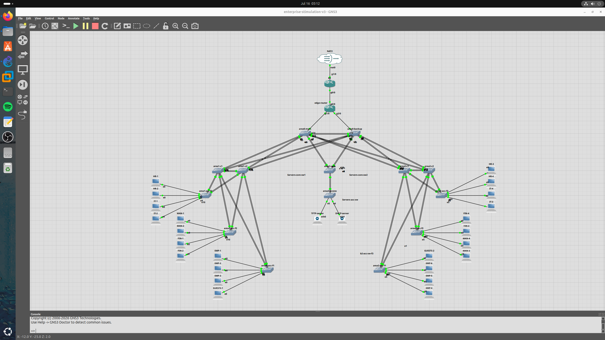
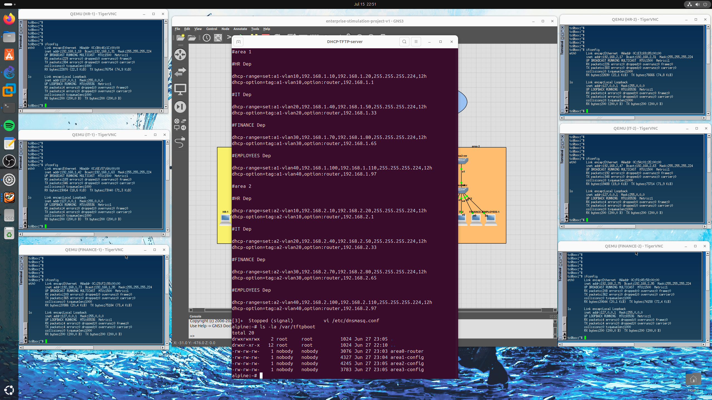
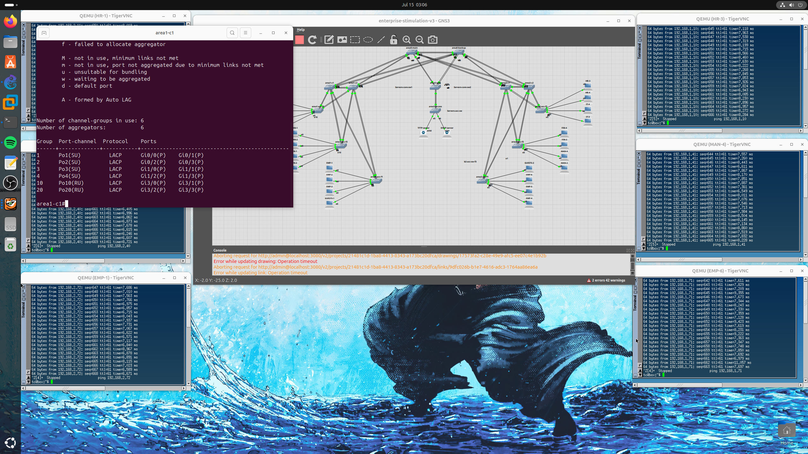
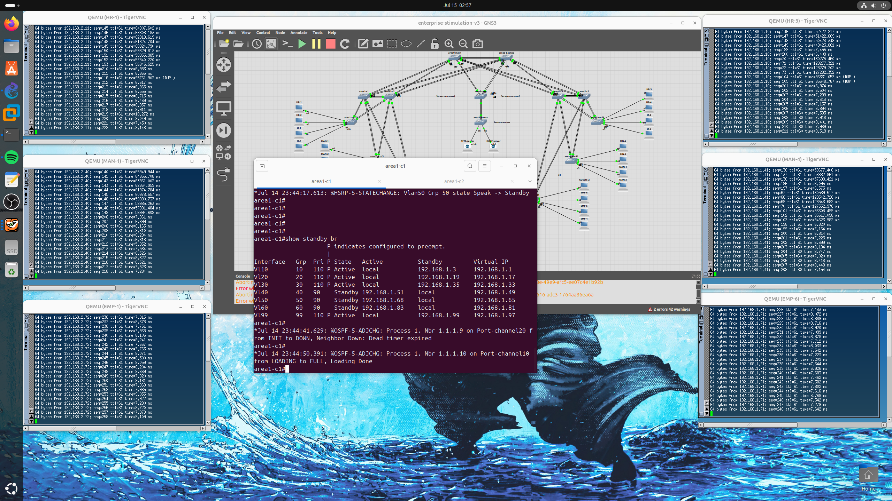
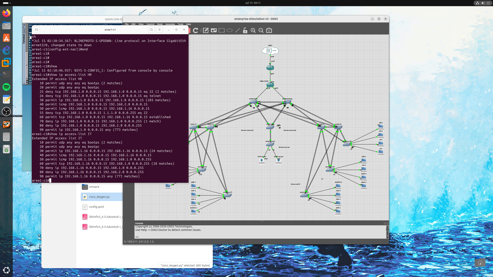
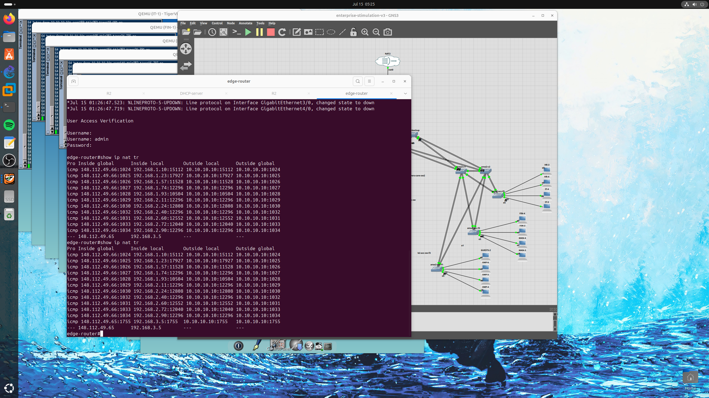

# 🏢 Enterprise Network Architecture & Security Simulation

> A multi-phase, enterprise-grade network design built and documented across three progressive versions — from foundational routing and scalability, through redundancy and fault tolerance, to full security hardening and perimeter defense.

## 📑 Table of Contents
- [Overview](#-overview)
- [Version 1 — Foundational Infrastructure & Scalability](#version-1--foundational-infrastructure--scalability)
- [Version 2 — Redundancy, Load Balancing & Fault Tolerance](#version-2--redundancy-load-balancing--fault-tolerance)
- [Version 3 — Security Hardening & Perimeter Defense](#version-3--security-hardening--perimeter-defense)
- [Summary](#-summary)
- [Connect](#-connect)

## 📘 Overview
This repository documents the architectural evolution and technical implementation of an enterprise network simulation, developed to achieve high scalability, redundancy, and hardened security. The design progressed through three major versions, each building on the last.

---

## Version 1 — Foundational Infrastructure & Scalability

### Hierarchical Multi-Area OSPF Design
To ensure efficient routing, the network was segmented into an OSPF hierarchy. Area 0 serves as the high-speed backbone, while Areas 1, 2, and 3 were established to partition organizational departments and the Server Farm. This design minimizes LSA propagation and reduces CPU overhead on backbone routers.

<!-- 📸 Add here: OSPF area diagram or `show ip ospf neighbor` output -->

### Centralized DHCP & TFTP Services
An Alpine Linux server was deployed to provide centralized DHCP services for six distinct VLANs, streamlining IP address management and eliminating the need for individual gateway configuration. A TFTP server was integrated to facilitate automated, centralized configuration backups, serving as a critical disaster recovery mechanism.

📂 [Browse all Version 1 screenshots](enterprise-simulation-lab-v1/lab-images)

---

## Version 2 — Redundancy, Load Balancing & Fault Tolerance

### Deterministic OSPF Routing
Manual configuration of loopback interface priorities was used to control DR/BDR (Designated Router / Backup Designated Router) elections within Area 0, ensuring consistent and predictable traffic paths.

### EtherChannel (LACP) Link Aggregation
LACP (802.3ad) bundles were deployed across all links between core and backbone switches. This provides both increased throughput (via load balancing across links) and immediate physical redundancy, maintaining connectivity even if a single physical link fails.

### STP & HSRP Optimization
- **Rapid PVST+** — Load balancing achieved by designating specific core switches as the Root Bridge for different VLAN ranges (VLANs 10–30 on Core 1; VLANs 40–60 on Core 2).
- **Gateway Redundancy (HSRP)** — Active/Standby states explicitly aligned with STP Root Bridge priorities, creating a symmetrical traffic flow where the primary gateway and the root bridge for a VLAN reside on the same high-priority device — preventing inefficient inter-switch traffic loops.

📂 Browse all Version 2 screenshots: [Part 1](enterprise-simulation-lab-v2.pt1/v2-images) · [Part 2](enterprise-simulation-lab-v2.p2/v2-images.pt2)

---

## Version 3 — Security Hardening & Perimeter Defense

### Access Layer Security (Layer 2 Hardening)
- **BPDU Guard & Root Guard** — Protects the STP topology. Root Guard prevents unauthorized switches from becoming the Root Bridge; BPDU Guard automatically disables a port if a rogue switch is connected, preventing bridge loops.
- **Port Security** — Sticky MAC address learning restricts each physical wall jack to exactly one device. Any deviation from the learned MAC address triggers an immediate port shutdown.

### Zero-Trust Traffic Control
- Extended ACLs were implemented per department to enforce a Zero-Trust architecture, strictly regulating lateral movement between departments.
- Server Farm management access is explicitly restricted to the IT subnet, blocking SSH attempts from other departments.

### Administrative Hardening
- SSH was enforced for all management traffic, completely disabling the insecure Telnet protocol.
- **Role-Based Access Control (RBAC)** deployed with two tiers: **Admin** (Privilege 15) for full configuration authority, and **Support** (Privilege 5) for limited, read-only operational monitoring.

### Edge & Perimeter Connectivity
- An Edge Router was configured with **NAT Overload (PAT)** to provide secure internet access for departmental users.
- **Static NAT** was configured for the Server Farm, providing reliable external connectivity for services while masking the internal private IP scheme from the public internet.

📂 [Browse all Version 3 screenshots](enterprise-simulation-lab-v3/v3-images)

---

## 📌 Summary
This simulation serves as a complete demonstration of enterprise-level network engineering, resilient infrastructure design, and best practices in security hardening — spanning routing, redundancy, and defense-in-depth.

