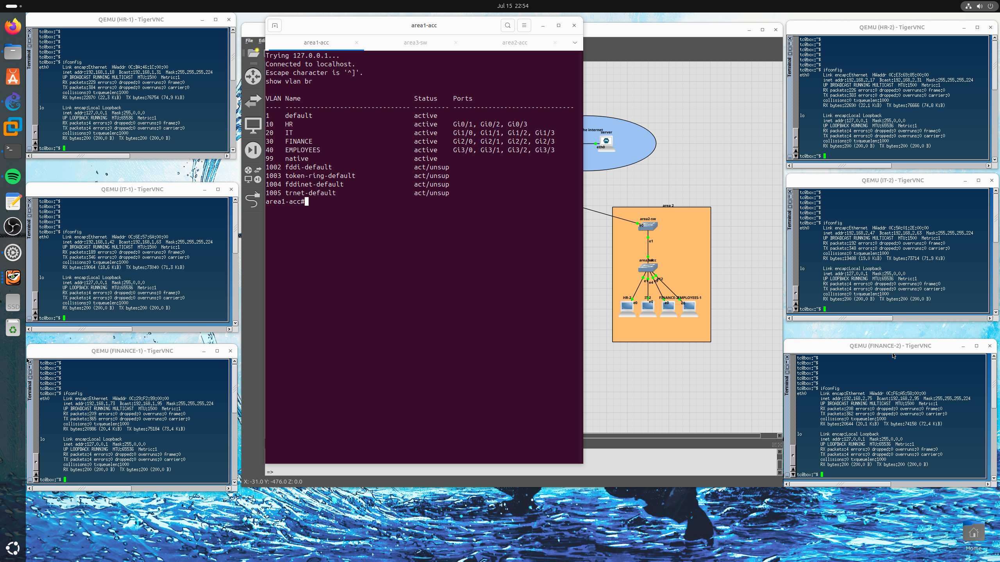
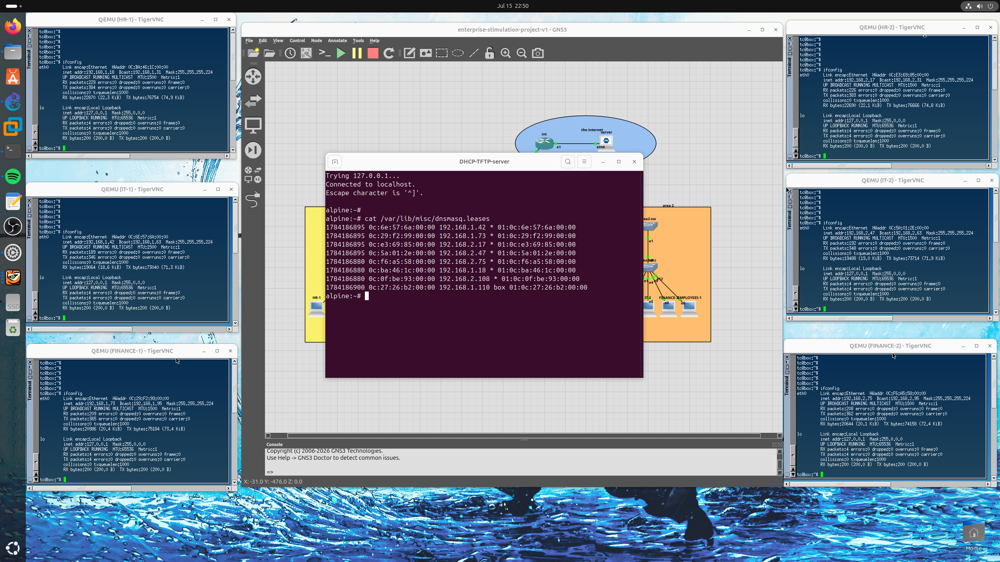
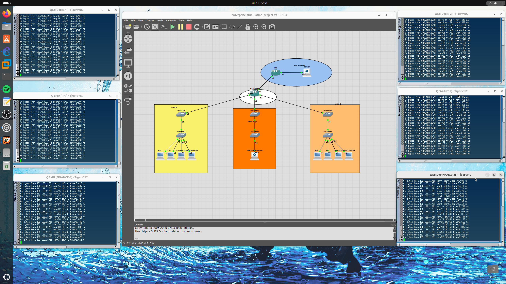
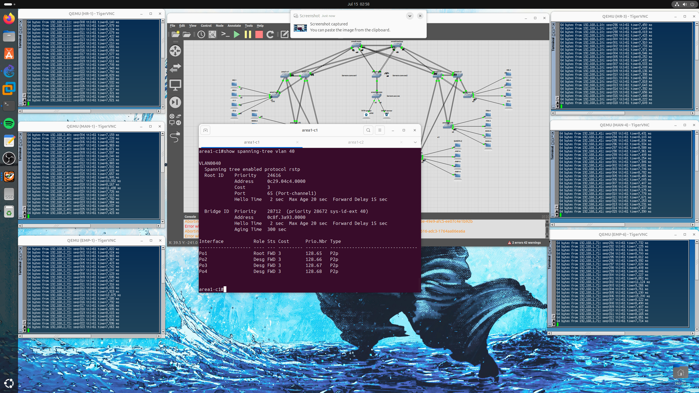
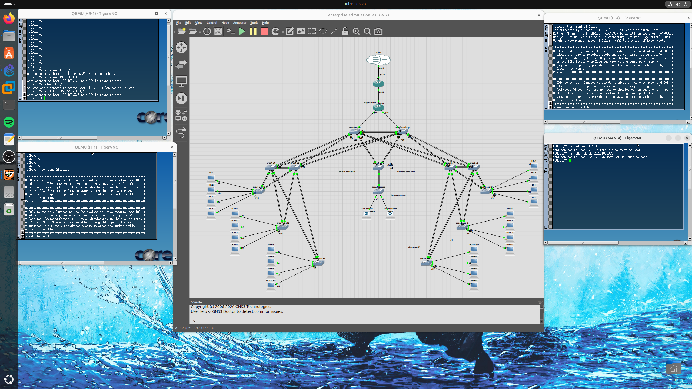
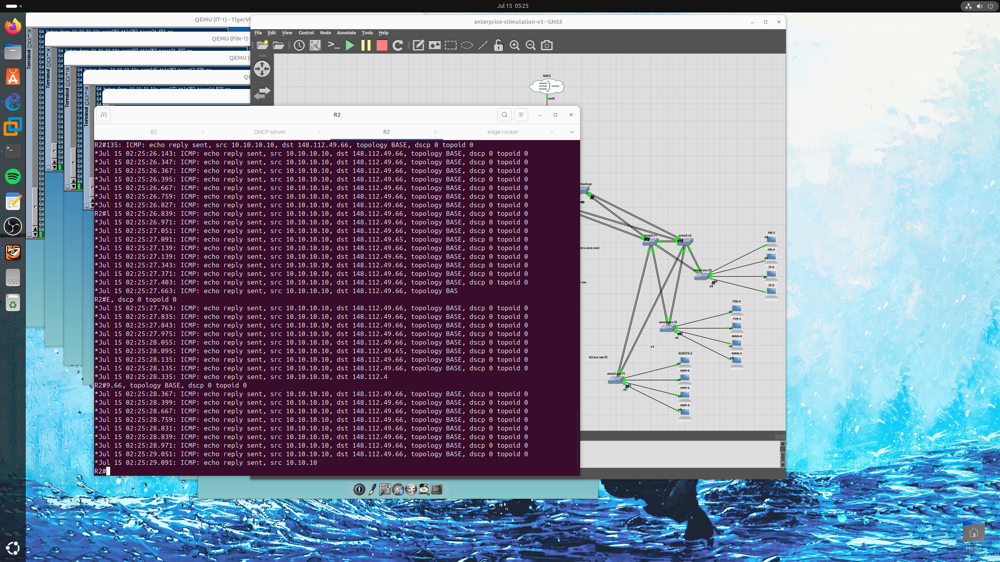

# 🏢 Enterprise Network Architecture & Security Simulation

> A multi-phase, enterprise-grade network design built and documented across three progressive versions — from foundational routing and scalability, through redundancy and fault tolerance, to full security hardening and perimeter defense. Each version was built on top of the last, mirroring how a real network matures over time: get it working, make it resilient, then lock it down.


## 📑 Table of Contents
- [Overview](#-overview)
- [Version 1 — Foundational Infrastructure & Scalability](#version-1--foundational-infrastructure--scalability)
- [Version 2 — Redundancy, Load Balancing & Fault Tolerance](#version-2--redundancy-load-balancing--fault-tolerance)
- [Version 3 — Security Hardening & Perimeter Defense](#version-3--security-hardening--perimeter-defense)
- [Repository Structure](#-repository-structure)
- [Summary](#-summary)
- [Connect](#-connect)

## 📘 Overview
This repository documents the architectural evolution and technical implementation of an enterprise network simulation, developed to achieve high scalability, redundancy, and hardened security. Rather than building everything at once, the design progressed through three deliberate versions — each one solving a different class of problem that a real enterprise network eventually has to face:

- **V1** answers: *"How do we route efficiently as the network grows?"*
- **V2** answers: *"What happens when a link or a device fails?"*
- **V3** answers: *"How do we make sure only the right people/devices can talk to each other?"*

---

## Version 1 — Foundational Infrastructure & Scalability


### Hierarchical Multi-Area OSPF Design
To ensure efficient routing, the network was segmented into an OSPF hierarchy. Area 0 serves as the high-speed backbone, while Areas 1, 2, and 3 were established to partition organizational departments and the Server Farm. This design minimizes LSA propagation — a topology change inside Area 1 doesn't force every router in Area 2 or Area 3 to re-run SPF — which keeps convergence fast and CPU overhead low on backbone routers as the network scales.


### VLAN Segmentation & Access Layer
Each department (and the Server Farm) sits on its own VLAN at the access layer, keeping broadcast domains small and giving each area a clean boundary to route between. This is also what made the centralized DHCP design (below) necessary — one server handing out addresses for six separate VLANs instead of six separate DHCP scopes.



### Centralized DHCP & TFTP Services
An Alpine Linux server was deployed to provide centralized DHCP services for six distinct VLANs. Since the DHCP server doesn't sit on every VLAN, `ip helper-address` was configured on the relevant SVIs so DHCP broadcast requests get relayed across the network to the central server — this streamlined IP address management and eliminated the need for per-VLAN gateway configuration. Additionally, a TFTP server was integrated to facilitate automated, centralized configuration backups, serving as a critical disaster recovery mechanism.




### Baseline Connectivity Verification
Before any security policy was layered on top (Version 3), end-to-end reachability between departments was verified — this baseline is the "before" picture that the Zero-Trust ACLs in V3 later restrict.



📂 [Browse all Version 1 screenshots](enterprise-simulation-lab-v1/lab-images)

---

## Version 2 — Redundancy, Load Balancing & Fault Tolerance

### Deterministic OSPF Routing
Manual configuration of loopback interface priorities was used to control DR/BDR (Designated Router / Backup Designated Router) elections within Area 0. Instead of letting elections happen by chance (highest router ID at boot time), the priority is fixed — so the DR/BDR roles are predictable and traffic paths stay consistent after a reboot or a reload, which matters a lot when troubleshooting.

### EtherChannel (LACP) Link Aggregation
LACP (802.3ad) bundles were deployed across all links between core and backbone switches. This provides both increased throughput (via load balancing across links) and immediate physical redundancy — connectivity is maintained even if a single physical link fails, without waiting on STP to re-converge.


### STP & HSRP Optimization
- **Rapid PVST+** — Load balancing achieved by designating specific core switches as the Root Bridge for different VLAN ranges (VLANs 10–30 on Core 1; VLANs 40–60 on Core 2). This splits traffic across both core switches instead of funneling everything through a single root.
- **Gateway Redundancy (HSRP)** — Active/Standby states explicitly aligned with STP Root Bridge priorities, so the primary gateway and the root bridge for a given VLAN sit on the *same* high-priority device. This keeps traffic flow symmetrical and avoids inefficient inter-switch hops where a host's gateway is on one core switch but its STP path goes through the other.




### Redundancy & Failover Verification
Configuring HSRP and STP load balancing isn't proof they actually work — so the active core switches were deliberately shut down (`shutdown` on the interface / powered off in GNS3) to confirm hosts kept full connectivity by failing over to the standby gateway and the alternate root bridge path. This was tested at both the distribution layer (Core 1 down, per area) and at the main/backbone switch.


📂 Browse all Version 2 screenshots: [Part 1](enterprise-simulation-lab-v2.pt1/v2-images) · [Part 2](enterprise-simulation-lab-v2.p2/v2-images.pt2)

---

## Version 3 — Security Hardening & Perimeter Defense

### Access Layer Security (Layer 2 Hardening)
- **BPDU Guard & Root Guard** — Protects the STP topology. Root Guard prevents unauthorized switches from becoming the Root Bridge; BPDU Guard automatically disables a port if a rogue switch is connected, preventing bridge loops.
- **Port Security** — Sticky MAC address learning restricts each physical wall jack to exactly one device. Any deviation from the learned MAC address triggers an immediate port shutdown, cutting off an obvious way to plug in an unauthorized device.

### Zero-Trust Traffic Control
Extended ACLs were implemented per department to enforce a Zero-Trust architecture — lateral movement between departments is strictly regulated by default, not just at the perimeter. Server Farm management access is explicitly restricted to the IT subnet, blocking SSH attempts from other departments.




### Administrative Hardening
- SSH was enforced for all management traffic, completely disabling the insecure Telnet protocol.
- **Role-Based Access Control (RBAC)** deployed with two tiers: **Admin** (Privilege 15) for full configuration authority, and **Support** (Privilege 5) for limited, read-only operational monitoring — so junior staff can monitor devices without being able to reconfigure them.


### Edge & Perimeter Connectivity
- An Edge Router was configured with **NAT Overload (PAT)** to provide secure internet access for departmental users, so internal private addressing is never exposed directly to the internet.
- **Static NAT** was configured for the Server Farm, providing reliable external connectivity for services while masking the internal private IP scheme from the public internet.




📂 [Browse all Version 3 screenshots](enterprise-simulation-lab-v3/v3-images)

---

## 🗂️ Repository Structure
```
Enterprise-Simualtion-Lab/
├── Enterprise-Lab-Finale.png            # Full topology (final version)
├── enterprise-simulation-lab-v1/
│   └── lab-images/                      # V1 screenshots
├── enterprise-simulation-lab-v2.pt1/
│   └── v2-images/                       # V2 screenshots — Part 1
├── enterprise-simulation-lab-v2.p2/
│   └── v2-images.pt2/                   # V2 screenshots — Part 2
├── enterprise-simulation-lab-v3/
│   ├── lab-configs/                     # V3 device configs
│   └── v3-images/                       # V3 screenshots
└── the-lab-configs/                     # Additional device configs
```

---

## 📌 Summary
This simulation serves as a complete demonstration of enterprise-level network engineering, resilient infrastructure design, and best practices in security hardening — spanning routing, redundancy, and defense-in-depth, with every stage backed by real verification (routing tables, failover tests, and ACL/NAT proof) rather than just configuration alone.
